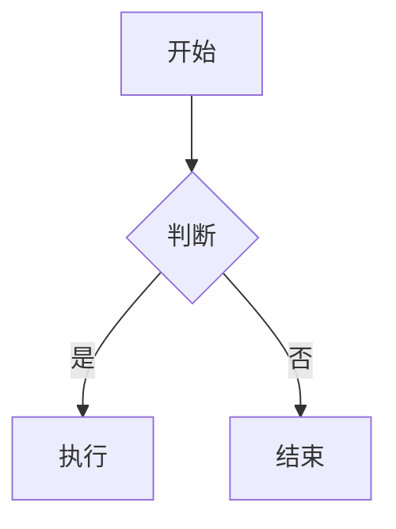
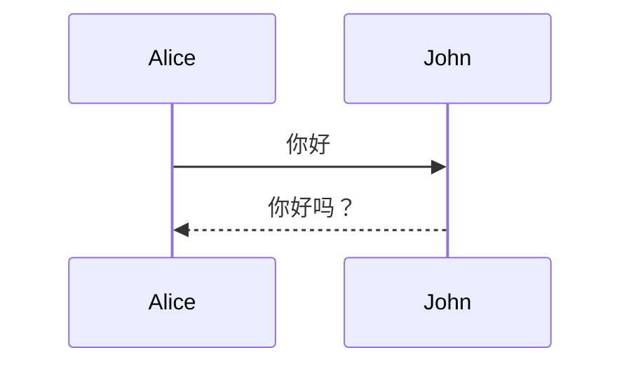

## desk

🔥一个由<u>rust</u>编写的ai cli工具🚀

[我的Github](https://github.com/linjingpy)

## 运行
```bash
cargo run
```

## 测试
```rust
use::std::stdin;

fn main (){

}
```

| 命令 | 说明 |
| --- | --- |
| cargo run | 运行 |
| cargo build | 编译 |
----------

- [ ] 基础对话功能
- [ ] Agent功能
- [ ] cli功能
- [ ] 网络请求

> 这是一级引用
>> 这是二级引用

这是一个带脚注的文本[^1]。

[^1]: 这是脚注的内容。

<mark>高亮显示</mark>



行内公式：$E = mc^2$

独立公式：
$$
\int_a^b f(x)\,dx = F(b) - F(a)
$$


